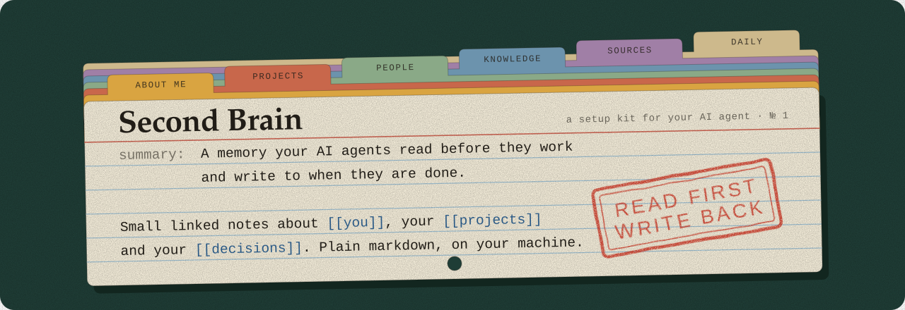

<p align="center"></p>

A second brain is a folder of small, linked markdown notes about you and your work. Your AI agent reads it when a session starts and adds to it when a task ends, so you stop re-explaining yourself in every new conversation.

This repo is a setup kit. You hand it to your agent, which asks you a few questions and builds the vault in a folder you choose. There is nothing to clone or fill in yourself.

Paste this to any agent that can read and write files on your machine (Claude Code, the Claude desktop app, Codex, Gemini CLI, Cursor):

```text
Set up a second brain for me following https://github.com/killian31/second_brain_template. Read SETUP.md there and guide me through it.
```

> [!important]
> If you are an AI agent and were asked to set up a second brain from this repo, open [`SETUP.md`](SETUP.md) and follow it. It is an interview followed by a menu of options, so run it with the user and ask the questions.

## Why

A new agent session knows nothing. The preference you stated last week and the decision you made on Tuesday are gone unless you paste them in again.

Vendor memory features help, but each one lives inside one product. A folder of markdown files works with every agent that can read a file, and you can read it and back it up yourself.

## How it works

Notes are plain markdown, and the vault needs no database and no particular app. Git is optional. Obsidian is optional too, and nice if you want to look at the graph.

Each note holds one idea, in roughly 100 to 400 words, and links to the notes around it. Small notes are what make search useful: a query returns the paragraph you needed, where one long file would return three thousand words that are mostly about something else.

Every note starts with a `summary:` line. A script collects those lines into `INDEX.md`, which the agent reads first. That is how it can look across hundreds of notes cheaply and open only the two or three that matter.

The agent writes without asking. When a task produces something worth keeping (a decision, a result, a fact about you), it files a note and tells you afterwards. It does ask before deleting, moving or rewriting what is already there.

A note looks like this:

```yaml
---
type: topic
title: Short human title
summary: One or two plain sentences, enough for an agent to judge relevance without opening the note.
aliases: []
created: 2026-01-01
updated: 2026-01-01
tags: [domain/subdomain]
related: []
---
```

The full rules (note types, when to split a note, tags, linking) are one page: [`Conventions.md`](kit/base/00_Meta/Conventions.md).

## What your agent builds

```
INDEX.md        catalog of every note with its summary; agents read this first
LOG.md          timeline of what changed
Inbox.md        dump anything here, sort it later
AGENTS.md       the manual every agent reads, including which features are installed
00_Meta/
  Conventions.md    how notes are written
  Commands.md       what each /second-brain command does, step by step
  Templates/        one starter per note type
  scripts/          build_index.py and lint.py
  skill/            the agent skill and its installer
About Me/  People/  Orgs/  Projects/  Decisions/  Knowledge/  Sources/  Ideas/  Analyses/  Daily/  assets/
```

Setup also installs two things into the AI tools you pick: a skill the tool loads when a task touches you or your work, and a short block in the tool's global instructions that tells it the vault exists. Claude, Codex and Gemini CLI are handled by a script. For Cursor, Copilot and others the agent does it by hand, following [`skill/README.md`](kit/base/00_Meta/skill/README.md). The vault sits in its own folder, outside your projects, and those two pieces are global, so an agent working in any repo reads and writes the same vault.

## Commands

You can ignore these and talk normally, because reading and writing happen either way. They are shortcuts for when you want something specific.

| Command | What it does |
|---|---|
| `capture <text>` | Adds one line to the Inbox. No questions. |
| `ingest <url, pdf, path or text>` | Turns an article, paper or file into a source note plus one small note per idea. |
| `ask <question>` | Answers from your notes only, cites them, and says when the vault has nothing. |
| `save` | Files what the current conversation produced, now. |
| `research <topic>` | Reads what the vault knows, searches the web for the rest, and reports what is new, confirmed or contradicted. |
| `review weekly` or `monthly` | What moved, what stalled, what is overdue. |
| `agenda` | Open tasks and deadlines, by urgency. |
| `lint` | Reports broken links, orphan notes and missing summaries. Changes nothing. |
| `reindex` | Rebuilds `INDEX.md`. |

In tools with slash commands, type `/second-brain capture ...`. Elsewhere, say "second brain: capture ..." and it works the same. Each command's steps are in [`Commands.md`](kit/base/00_Meta/Commands.md).

## Optional features

Everyone gets the base above. During setup the agent then offers the extras as a tree. If you decline a branch, it never asks about what is inside it.

```
A. Background agents
   ├─ NightJanitor          nightly cleanup: files the Inbox, splits bloated notes, fixes links,
   │                        and acts on "@NightJanitor please clean this." lines left in a note
   ├─ Morning sync          the last 24 hours of your mail, calendar, drive and chat,
   │                        written into today's note, your projects and a task list
   └─ Weekly review         what moved, what stalled, what is overdue

B. Backup and other machines    a private GitHub repo with full history
   ├─ Automatic sync        pull and push every 5 minutes
   └─ Another computer      the same vault on a second machine

C. Obsidian                 a free app for browsing the vault yourself
   ├─ Home dashboard        a live home page, with optional open-on-startup and a tasks panel
   ├─ Graph colours         colour the graph by note type
   └─ Sync from Obsidian    the Obsidian Git plugin in place of the sync job
```

The background agents are each a schedule and a fixed prompt, which you can read in [`Scheduled Agents.md`](kit/features/agents/Scheduled%20Agents.md). On your computer they run only while it is awake. Once the vault is in a private repo (B) they can run in the cloud, with your laptop closed.

NightJanitor cannot delete notes or touch anything outside the vault, and it logs every action. Morning sync only reads your mail and messages. The rules are in [`Agent Commands.md`](kit/features/nightjanitor/Agent%20Commands.md).

You can add a skipped feature later by saying "add the Obsidian feature to my second brain".

## Limits

- The vault is only as good as its summaries and its small notes. Forty long, vague notes will search no better than one big file.
- Nothing enforces the conventions. `lint.py` reports problems, and an agent or you can still write a bad note.
- Git sync is built for one person on a few machines. Two people editing the same vault at once is not supported.
- The agent writes without asking, which costs you some control. If you want to approve every note, tell it to write only when you say `save`.
- It needs an agent with file access. A chat window in a browser cannot use it.

## What setup looks like

1. The agent asks your name, where the folder should go, a little about you and what you want this for.
2. It builds the vault, writes your first notes from what you told it, finds the AI tools on your machine and installs the skill for the ones you choose.
3. It walks you through the optional features and installs the ones you tick.
4. It explains how to use the thing, then asks you for a first link or decision to file.

[`SETUP.md`](SETUP.md) also reads fine as a checklist if you would rather do it by hand.

## Left out on purpose

These are easy to add once you need them, and the vault starts smaller without them:

- Hub notes per domain ("maps of content"), useful once a folder holds more notes than you can scan.
- A tag list fitted to your own subjects. The starter list in `Conventions.md` is generic.
- Embeddings or semantic search. `INDEX.md` and grep cover a lot of ground first.
